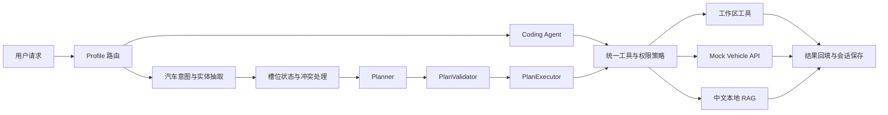

# Minicoder

> 一个可读、可扩展的 Python LLM Agent：既能作为安全的终端 Coding Agent，也能完成汽车场景中的意图理解、任务规划、工具调用和中文知识检索。

[](https://github.com/rgfan123/car-agent/releases/tag/v0.3.0)
[](https://www.python.org/)
[](https://github.com/rgfan123/car-agent/actions/workflows/ci.yml)
[](#测试与质量)
[](LICENSE)

Minicoder 从零实现了一条完整的 LLM Agent 执行链路：模型生成工具调用，系统完成权限校验和任务执行，再将结构化结果回填给模型。`v0.3.0` 在通用 Coding Agent 的基础上新增 Automotive Profile，用一个可离线运行的汽车助手场景展示结构化意图与实体抽取、槽位状态、受限任务规划、模拟车辆业务 API 和中文本地 RAG。

项目强调代码可读性、安全边界和可验证性，适合作为学习 LLM Agent 架构、工具调用协议和汽车 AI 应用开发的工程化参考。Mock Vehicle API 与随包知识语料用于教学和本地测试，不代表生产车辆系统。

## 核心能力

| 方向 | 已实现能力 |
|------|------------|
| Agent 核心 | Agent Loop、流式输出、工具调用、读写分离并发、OpenAI 兼容接口与 Anthropic |
| 对话理解 | 汽车意图识别、实体抽取、时间规范化、槽位补全、冲突确认、纠错与取消 |
| 任务规划 | Rule-based / Constrained Hybrid Planner、Action Registry、计划校验、步骤依赖与安全 `$ref` |
| 业务集成 | FastAPI Mock Vehicle API、车辆状态、路线估算、充电站查询、空调控制与权限策略 |
| 中文 RAG | jieba 预分词、SQLite FTS5/BM25、车型/分类过滤、增量索引、损坏重建与 Citation |
| 工程可靠性 | 工作区沙箱、allow/ask/deny、只读模式、流式安全重试、原子会话保存与跨平台 CI |

## 工作流程



## 快速开始

```bash
git clone https://github.com/rgfan123/car-agent.git
cd car-agent
pip install -e .                 # 或 pip install -e ".[dev]" 装测试依赖

export OPENAI_API_KEY=sk-xxx     # 见下方「配置」
minicoder                        # 进入 REPL,输入你的需求
```

汽车演示 Profile 需要额外安装 Mock API 依赖：

```bash
pip install -e ".[automotive]"
minicoder-vehicle-api --host 127.0.0.1 --port 8765
```

PowerShell 使用相同命令；启动后可访问 `http://127.0.0.1:8765/docs` 查看交互式 API 文档。

## 核心设计

| 模块 | 职责 | 关键设计 |
|------|------|----------|
| `agent.py` | Agent 核心引擎 | Agent Loop + 连续只读工具并发 + 写工具串行 |
| `context.py` / `models.py` | 上下文系统 | 完整 Turn 原子分组 + 模型窗口/Token 档案 + 三层压缩 |
| `tools/base.py` | 通用工具系统 | fail-closed 默认；并发和只读属性必须显式声明 |
| `security.py` / `tools/bash.py` | 权限与工作区安全 | allow/ask/deny + 只读模式 + Shell 风险分级 + 路径边界 |
| `providers.py` / `retry.py` | 模型服务适配 | Provider capabilities + 错误分类 + 首 Token 前安全重试 |
| `intent.py` / `understanding.py` | 结构化对话理解 | 意图、实体、时间规范化、槽位状态和规则降级 |
| `actions.py` / `planner.py` | 任务规划 | 统一动作契约 + 规则计划 + 可选受限 LLM 计划 |
| `executor.py` | 计划校验与执行 | Schema、依赖、权限和 `$ref` 校验 + 顺序执行 |
| `vehicle/` | 汽车业务服务 | Mock API + 类型化客户端 + 状态仓库 + 车辆权限 |
| `knowledge/` | 中文本地 RAG | 安全加载 + jieba + FTS5/BM25 + 原子增量索引 |
| `session.py` | Transcript 持久化 | Schema v2 + 原子替换 + `.bak` 恢复 + JSON/Markdown 导出 |

## 配置

复制 `.env.example` 为 `.env` 并填写,或直接用环境变量:

```bash
# OpenAI 兼容(OpenAI / DeepSeek / Ollama / Kimi / Qwen ...)
export MINICODER_PROVIDER=openai
export OPENAI_API_KEY=sk-xxx
export OPENAI_BASE_URL=https://api.openai.com/v1   # 换后端只改这里

# 或 Anthropic
export MINICODER_PROVIDER=anthropic
export ANTHROPIC_API_KEY=sk-ant-xxx
```

本地跑 Ollama:`OPENAI_BASE_URL=http://localhost:11434/v1`,API key 随便填。

| 环境变量 | 作用 | 默认 |
|---------|------|------|
| `MINICODER_PROVIDER` | `openai` 或 `anthropic` | `openai` |
| `OPENAI_API_KEY` / `OPENAI_BASE_URL` | OpenAI 兼容后端凭据与地址 | — / 官方地址 |
| `ANTHROPIC_API_KEY` | Anthropic 凭据 | — |
| `MINICODER_MODEL` | 模型覆盖 | 按 provider 给默认 |
| `MINICODER_MAX_ROUNDS` | 单次对话最大轮数(防跑飞) | `50` |
| `MINICODER_CONTEXT_WINDOW` | 模型上下文窗口 | 按模型(`gpt-4o`: `128000`) |
| `MINICODER_OUTPUT_RESERVE` | 为模型回答预留的 token | 按模型(`gpt-4o`: `16384`) |
| `MINICODER_READ_ONLY` | 无条件禁止文件写入、编辑和 Shell | `false` |
| `MINICODER_AUTOSAVE` | 交互式 REPL 在协议完整边界自动保存 | `true` |
| `MINICODER_AUTOSAVE_NAME` | 自动保存会话名 | `autosave` |
| `MINICODER_MAX_RETRIES` | 瞬时错误最大重试次数 | `3` |
| `MINICODER_RETRY_BASE_DELAY` | 指数退避初始秒数 | `1` |
| `MINICODER_RETRY_MAX_DELAY` | 指数退避最大秒数 | `8` |
| `MINICODER_RETRY_MAX_WAIT` | Retry-After 最大等待秒数 | `60` |
| `MINICODER_PERMISSION_MODE` | 写操作权限:`allow` / `ask` / `deny` | `ask` |
| `MINICODER_PROFILE` | 应用 Profile:`coding` / `automotive` | `coding` |
| `MINICODER_INTENT_MODEL` | 汽车意图抽取模型 | 主模型 |
| `MINICODER_TIMEZONE` | 相对时间解释使用的 IANA 时区 | `Asia/Shanghai` |
| `MINICODER_INTENT_RULE_FAST_PATH` | 高确定性规则快速路径 | `true` |
| `MINICODER_VEHICLE_API_URL` | Vehicle API 根地址 | `http://127.0.0.1:8765` |
| `MINICODER_VEHICLE_API_TOKEN` | Vehicle API Bearer Token | `local-demo-token` |
| `MINICODER_VEHICLE_API_TIMEOUT` | 单次 Vehicle API 超时秒数 | `5` |
| `MINICODER_VEHICLE_API_ALLOW_REMOTE` | 显式允许连接非 localhost 服务 | `false` |
| `MINICODER_VEHICLE_PERMISSION_MODE` | 车辆控制权限:`allow` / `ask` / `deny` | `ask` |
| `MINICODER_VEHICLE_ALLOWED_IDS` | 可选车辆 ID 白名单，逗号分隔 | 空 |
| `MINICODER_KNOWLEDGE_DIR` | 自定义知识目录，留空使用随包语料 | 空 |
| `MINICODER_KNOWLEDGE_INDEX` | SQLite FTS5 索引路径 | `.minicoder/knowledge.db` |
| `MINICODER_KNOWLEDGE_TOP_K` | 默认返回片段数，范围 1～20 | `5` |
| `MINICODER_KNOWLEDGE_AUTO_REBUILD` | 启动时按哈希增量更新索引 | `true` |
| `MINICODER_PLANNER_MODE` | `rules` 或受限 `hybrid` | `rules` |
| `MINICODER_PLANNER_MODEL` | 可选独立 Planner 模型 | 意图模型 |

## 使用

```bash
minicoder                        # 进入 REPL
minicoder -p "创建 hello.py 打印 hello"   # 无头模式,执行单条后退出
minicoder --provider anthropic --model claude-sonnet-4-5
minicoder --permission-mode deny       # 禁止 Agent 写文件和执行 Shell
minicoder --read-only                  # 全局只读,优先级高于权限模式
minicoder --profile automotive         # 启用汽车结构化理解
minicoder --analyze-intent "查询 A102 的续航"  # 只输出意图、实体与初始计划
```

### 汽车任务演示（实验性）

`automotive` Profile 会在主 Agent 前增加独立理解层，输出固定意图、已验证实体、原文证据、
缺失字段和初始规则计划。信息不完整或槽位冲突时只追问，不进入工具执行。计划就绪后，受限
`PlanExecutor` 会按顺序调用本地 Mock Vehicle API；控制操作仍需通过独立车辆权限策略。

启动两个终端完成复杂行程演示：

```powershell
# 终端 1（PowerShell）
minicoder-vehicle-api --host 127.0.0.1 --port 8765

# 终端 2（PowerShell）
$env:MINICODER_PROFILE="automotive"
$env:MINICODER_VEHICLE_PERMISSION_MODE="ask"
minicoder
# 输入：查询 A102 当前续航，明早八点去上海虹桥站，判断是否需要充电
```

```bash
# 终端 2（Bash；终端 1 的启动命令相同）
export MINICODER_PROFILE=automotive
export MINICODER_VEHICLE_PERMISSION_MODE=ask
minicoder
```

行程充电计划固定为六步：车辆状态 → 路线估算 → 能耗计算 → 沿途充电站查询 → 充电建议 →
本地长途知识检索。
步骤引用只允许读取已声明依赖的前序输出，不支持循环、并行、表达式或动态重规划。`/intent`
可查看本轮结构化理解、初始计划和完整执行报告。

### 本地中文 RAG

Automotive Profile 随包提供 5 篇明确标注为教学数据的汽车知识文档。知识源由
`manifest.json` 描述，加载器拒绝 `..`、绝对路径、符号链接逃逸、超大文件和重复文档。
Markdown 按标题和长度分块，索引与查询共用 `jieba.cut_for_search` 和汽车领域词典，再通过
SQLite FTS5 BM25 检索。原文与 Token 字段分开存储，索引在临时数据库中增量更新并由
`os.replace()` 原子发布；损坏索引会从源文档重建。

`KnowledgeRetriever` 是稳定扩展接口，当前只实现 `BM25Retriever`。后续 Embedding 和 RRF
混合检索可以复用同一工具协议，不需要修改 Planner。回答中的知识片段属于不可信参考数据，
不能覆盖系统指令；结果包含文档、章节和 `citation`，无可靠结果时应明确拒答。

`MINICODER_PLANNER_MODE=rules` 默认使用确定性模板，不增加 Planner 模型调用。显式设置
`hybrid` 后，导航、行程和知识意图允许增加一次非流式规划调用；模型只能从
`ActionRegistry` 选择能力，候选计划必须通过步骤上限、Schema、依赖、`$ref` 和只读检查，
否则自动回退规则计划。暂不实现没有替代数据源的伪重规划。

Mock API 是教学与本地测试组件，不是生产车辆服务。它使用进程内 JSON 状态和线程锁，不提供
数据库持久化、分布式锁、多实例一致性、真实车端认证、TLS、密钥托管、审计治理或生产监控。
服务端只允许绑定 localhost；客户端连接远程测试服务也必须显式设置
`MINICODER_VEHICLE_API_ALLOW_REMOTE=true`。API 当前只有 `/v1`，不提供空壳 `/v2`。

故障注入接口默认不存在。仅自动化测试设置 `MINICODER_MOCK_TEST_MODE=true` 后才注册
`/__test__/faults` 和 `/__test__/reset`，不要在共享或生产环境开启。

未命中意图规则时会增加一次非流式抽取调用；`hybrid` Planner 对符合条件的复杂请求再增加
一次调用。两者 token 都计入本轮统计；生产环境可通过独立小模型、规则快速路径、限制上下文
和短期缓存降低成本。

权限模式说明:

- `deny`:允许读取工作区，拒绝文件写入、编辑和 Shell。
- `ask`:写入、编辑和 Shell 执行前询问；无头模式无法询问时拒绝。
- `allow`:工作区内写操作无需询问；critical Shell 命令仍会拒绝。

旧值 `strict / interactive / trusted` 会分别迁移到 `deny / ask / allow`。

Shell 权限门控不等同于操作系统沙箱。若需要强隔离,应在容器或受限系统账户中运行 minicoder。

REPL 斜杠命令:

交互模式默认将完整 Transcript 原子保存为 `autosave`;无头 `-p` 模式不会创建会话文件。
`/sessions` 会标出 `ok`、`recoverable`、`corrupted` 或 `unsupported` 状态。

| 命令 | 作用 |
|------|------|
| `/model [名称]` | 查看或切换模型 |
| `/compact` | 强制安全压缩 Working Context |
| `/tokens` | 输入预算、上下文占用与成本估算 |
| `/diff` | git 改动概览 |
| `/save [名称]` `/sessions` `/load <名称>` | 会话保存 / 列表 / 恢复 |
| `/export <json\|markdown> [路径]` | 原子导出当前完整 Transcript |
| `/intent` | 查看最近一次汽车结构化意图、初始计划与执行报告 |
| `/help` · `quit`/`exit` | 帮助 / 退出(对话中 Ctrl+C 取消当前轮) |

## 内置工具

`bash` · `read_file` · `write_file` · `edit_file`(唯一文本匹配替换)· `glob` · `grep` · `agent`(子 agent,禁止递归)

Automotive Profile 额外装配 `get_vehicle_status`、`estimate_route`、`get_charging_stations` 和
`control_vehicle_climate`、`search_vehicle_knowledge`。这些 Tool 与 PlanExecutor 共享同一份
`ActionDefinition`，避免参数 Schema 漂移。读取操作直接执行；车辆控制默认 `ask`，无头模式
无法确认时拒绝，全局 `--read-only` 会无条件禁止车辆控制。

## 测试与质量

```bash
pip install -e ".[dev,automotive]"
pytest          # 206 个测试通过、1 个按环境跳过，不触真实 API
ruff check .
ruff format --check .
pytest --cov=minicoder --cov-branch --cov-report=term-missing --cov-report=xml
python -m build
python scripts/evaluate_intent.py \
  --expected tests/fixtures/vehicle_intents.jsonl \
  --predicted tests/fixtures/vehicle_intent_predictions.example.jsonl
python scripts/evaluate_knowledge.py \
  --dataset tests/fixtures/vehicle_knowledge_queries.jsonl \
  --top-k 3 --min-recall 0.9 --min-mrr 0.8
```

测试分为模块单测和本地假 OpenAI Server 驱动的黑盒 E2E。E2E 会通过真实 CLI
子进程执行一次 Provider → Agent → Tool 闭环，但不会访问互联网或读取真实 API Key。
意图评测脚本对独立 JSONL 标注与预测计算意图准确率、实体 Precision/Recall/F1、完整匹配率、
缺失字段指标和错误 `ready` 安全失败率；真实模型预测应单独生成并保留模型与 Prompt 版本。
知识评测计算 Recall@K、MRR 和无答案拒答率。随包 11 条小型回归集只用于防止检索退化，不能
代表生产语料效果；扩充知识库时应同步增加独立标注问题。

GitHub Actions 在 Ubuntu/Windows 的 Python 3.10～3.13 上执行强制测试，Python 3.14
作为允许失败的前瞻任务，并强制执行 Ruff、85% 分支覆盖率及 wheel 安装验证。
当前本地分支覆盖率为 86.47%。

## 目录结构

```
minicoder/
├── config.py       # 环境变量 + .env 加载
├── prompt.py       # system prompt + git/项目上下文
├── providers.py    # Provider 抽象(OpenAI 兼容 + Anthropic),流式,重试
├── retry.py        # Retry-After + 指数退避 + 结构化 Provider 错误
├── context.py      # 双轨上下文 + 协议分组 + 三层压缩
├── models.py       # 模型窗口 + token 估算档案
├── actions.py      # Planner/Executor/Tool 共用 Action 能力协议
├── intent.py       # 汽车意图/实体协议 + 时间规范化 + 本地校验
├── understanding.py # 结构化抽取 + 规则降级 + 槽位状态
├── planner.py      # 规则模板 + 可选受限 Hybrid Planner
├── executor.py     # PlanValidator + 顺序执行 + 安全前序引用
├── knowledge/      # 安全加载 + jieba + FTS5/BM25 + 教学语料
├── vehicle/        # Mock API + 类型化客户端 + 状态仓库 + 车辆权限
├── session.py      # 原子持久化 + Schema 迁移 + 备份恢复
├── agent.py        # Agent Loop + 读写分离并发
├── cli.py          # REPL + 斜杠命令
└── tools/          # 编码工具 + Automotive 车辆工具
```

## Roadmap

- **混合检索**：接入中文 Embedding，通过 RRF 融合 BM25 与向量召回，并增加重排与答案忠实度评测。
- **记忆系统**：在当前槽位状态上增加短期会话摘要与长期用户偏好记忆，提供可查看、修改和删除的记忆边界。
- **实体链接**：将自然语言中的车辆名称、地点和车型映射到稳定业务实体，并处理别名与歧义消解。
- **多 Agent 复核**：增加 Planner、Executor、Reviewer 协作流程，让 Reviewer 基于事实和执行报告检查结果，而非重复生成答案。
- **有限重规划**：仅在存在缓存、备用 API 或替代 Action 时，对可恢复错误触发一次受控重规划。
- **真实业务接入**：补充 OAuth、密钥托管、审计日志、按车辆授权和真实汽车云端 API 适配器。
- **可观测性与部署**：增加结构化日志、Tracing、延迟/Token 成本指标、Docker 镜像和演示 Web 控制台。
- **评测扩展**：扩充汽车知识库及独立标注集，持续评估意图、实体、规划、检索和端到端任务成功率。

## 当前边界

- Mock Vehicle API 是本地教学服务，不包含真实车端认证、TLS、持久化数据库或多实例一致性。
- 当前 `KnowledgeRetriever` 只实现 BM25，尚未实现 Embedding 和 RRF 混合检索。
- 当前 Planner/Executor 是受限单 Agent 工作流，尚未实现独立 Reviewer 和多 Agent 协作。
- 当前上下文支持短期槽位状态和可靠会话保存，尚未实现长期用户偏好记忆。
- RAG 的 11 条样本是离线回归集，只用于防止功能退化，不能视为生产准确率。
- Token 统计采用模型感知的本地估算，不等同于 Provider 官方精确计费结果。

## 版本记录

当前版本为 `v0.3.0`，完整变更见 [CHANGELOG.md](CHANGELOG.md)。

## License

[MIT](LICENSE)
