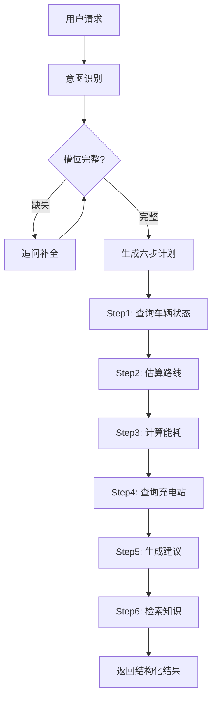

# Minicoder 车载AI智能助手 - 技术文档

## 📋 项目概述

**项目名称**: Minicoder - 车载AI智能助手  
**版本**: v0.3.0  
**语言**: Python 3.10-3.13  
**代码规模**: 7,773行核心代码，43个模块  
**测试覆盖**: 206个测试用例，86.47%分支覆盖率  
**开源协议**: MIT

Minicoder 是一个可读、可扩展的 Python LLM Agent，既能作为安全的终端 Coding Agent，也能完成汽车场景中的意图理解、任务规划、工具调用和中文知识检索。项目强调代码可读性、安全边界和可验证性，适合作为学习 LLM Agent 架构、工具调用协议和汽车 AI 应用开发的工程化参考。

---

## 🏗️ 系统架构

### 核心技术栈

| 技术领域 | 技术选型 | 说明 |
|---------|---------|------|
| **编程语言** | Python 3.10-3.13 | 类型注解、dataclass、Pattern Matching |
| **LLM集成** | OpenAI Compatible + Anthropic | 双Provider适配，支持DeepSeek/Ollama/Kimi等 |
| **Web框架** | FastAPI + Uvicorn | Mock Vehicle API服务 |
| **中文NLP** | jieba分词 | 汽车领域词典定制 |
| **检索引擎** | SQLite FTS5 + BM25 | 本地全文检索 |
| **HTTP客户端** | httpx | 异步支持 |
| **测试框架** | pytest + pytest-cov | 单测+E2E+离线评测 |
| **代码质量** | ruff | Linter + Formatter |

### 五层架构设计

```
┌─────────────────────────────────────────────────────────┐
│                     用户请求层                           │
│          (自然语言输入 / CLI / REPL)                      │
└────────────────────┬────────────────────────────────────┘
                     │
┌────────────────────▼────────────────────────────────────┐
│              1. 对话理解层 (Understanding)               │
│  ┌────────────┐  ┌──────────────┐  ┌────────────────┐  │
│  │ 意图识别    │→│  实体抽取     │→│  槽位状态管理   │  │
│  │ IntentName │  │  车辆ID/地点  │  │  补全/确认/纠错 │  │
│  └────────────┘  └──────────────┘  └────────────────┘  │
└────────────────────┬────────────────────────────────────┘
                     │
┌────────────────────▼────────────────────────────────────┐
│              2. 任务规划层 (Planner)                     │
│  ┌──────────────────┐  ┌────────────────────────────┐  │
│  │  规则模板 (Rule)  │  │ 受限混合 (Hybrid + 回退)   │  │
│  │  零额外LLM调用    │  │ Schema校验/依赖检查        │  │
│  └──────────────────┘  └────────────────────────────┘  │
└────────────────────┬────────────────────────────────────┘
                     │
┌────────────────────▼────────────────────────────────────┐
│           3. 执行引擎层 (Executor + Agent Loop)          │
│  ┌──────────────────┐  ┌────────────────────────────┐  │
│  │  读写分离并发     │  │  安全$ref引用机制          │  │
│  │  只读8并发/写串行 │  │  前序输出依赖检查          │  │
│  └──────────────────┘  └────────────────────────────┘  │
│  ┌──────────────────────────────────────────────────┐  │
│  │  流式输出 + 重试策略 (指数退避 + Retry-After)     │  │
│  └──────────────────────────────────────────────────┘  │
└────────────────────┬────────────────────────────────────┘
                     │
        ┌────────────┴────────────┐
        │                         │
┌───────▼──────────┐   ┌─────────▼──────────┐
│ 4. 业务服务层    │   │ 5. 知识检索层      │
│ (Vehicle API)    │   │ (RAG)              │
├──────────────────┤   ├────────────────────┤
│ • 车辆状态查询   │   │ • jieba预分词      │
│ • 路线估算       │   │ • FTS5/BM25索引    │
│ • 充电站检索     │   │ • 增量哈希更新     │
│ • 空调控制       │   │ • Citation标注     │
│ • 权限策略       │   │ • 5篇车型文档      │
└──────────────────┘   └────────────────────┘
```

---

## 🎯 核心模块详解

### 1. 对话理解层 (Understanding)

**文件**: `minicoder/understanding.py`, `minicoder/intent.py`

#### 1.1 意图识别

支持7种车载意图：

| 意图类型 | IntentName | 典型场景 |
|---------|-----------|---------|
| 续航查询 | `RANGE_QUERY` | "A102还能跑多远" |
| 车辆状态查询 | `VEHICLE_STATUS_QUERY` | "查询A102当前状态" |
| 空调控制 | `CLIMATE_CONTROL` | "把空调调到24度" |
| 导航请求 | `NAVIGATION_REQUEST` | "导航去虹桥站" |
| 行程充电规划 | `TRIP_CHARGE_PLANNING` | "明早8点去上海，是否需要充电" |
| 充电站查询 | `CHARGING_STATION_QUERY` | "附近有哪些充电站" |
| 知识查询 | `VEHICLE_KNOWLEDGE_QUERY` | "冬天如何保养电池" |

#### 1.2 实体抽取

结构化参数提取：

```python
{
    "vehicle_id": "A102",           # 车辆标识
    "destination": "上海虹桥站",     # 目的地
    "departure_time": "2026-09-05T08:00+08:00",  # 时间规范化
    "temperature": 24.0,            # 温度（16-30℃）
    "action": "set_temperature",    # 空调动作
    "evidence": {                   # 原文证据
        "vehicle_id": "A102",
        "destination": "上海虹桥站"
    }
}
```

**时间规范化**：
- 相对时间解析：明天/后天/下周一
- 时区感知：Asia/Shanghai
- 模糊时间补全："明早" → 08:00

#### 1.3 槽位状态管理

**三轮补全策略**：

```python
@dataclass
class PendingIntent:
    intent: IntentName
    slots: dict[str, SlotValue]      # 已确认槽位
    missing_fields: tuple[str, ...]  # 缺失字段
    turns_remaining: int = 3         # 剩余轮次
```

**支持场景**：
- **补全**: "去哪里？" → 用户补充目的地
- **确认**: 检测冲突时主动询问（车辆位置与起点不符）
- **纠错**: 正则识别"不是X是Y"、"改成Z"
- **取消**: "算了"、"不用了" → 清空槽位状态

---

### 2. 任务规划层 (Planner)

**文件**: `minicoder/planner.py`

#### 2.1 规则模板 (RuleBasedPlanner)

零额外LLM调用的确定性计划生成：

```python
# 行程充电规划固定六步
def _trip_charge(entities: dict[str, Any]) -> list[PlanStep]:
    return [
        PlanStep("vehicle_status", "get_vehicle_status", 
                 {"vehicle_id": entities["vehicle_id"]}),
        PlanStep("route", "estimate_route",
                 {"vehicle_id": entities["vehicle_id"],
                  "destination": entities["destination"]},
                 depends_on=("vehicle_status",)),
        PlanStep("energy_calc", "calculate_energy_requirement",
                 {"route_distance": "$steps.route.distance_km",
                  "battery_capacity": "$steps.vehicle_status.battery_capacity_kwh"},
                 depends_on=("route", "vehicle_status")),
        PlanStep("charging_stations", "get_charging_stations",
                 {"corridor": "$steps.route.waypoints"},
                 depends_on=("route",)),
        PlanStep("charge_advice", "generate_charging_advice",
                 {"energy_need": "$steps.energy_calc.need_charge"},
                 depends_on=("energy_calc", "charging_stations")),
        PlanStep("knowledge", "search_vehicle_knowledge",
                 {"query": "长途行程电池注意事项"},
                 required=False)
    ]
```

**$ref安全机制**：
- 只能引用 `depends_on` 声明的步骤
- 运行时解析路径：`$steps.<step_id>.<field>`
- 校验器强制检查，杜绝跨步骤数据泄露

#### 2.2 受限混合规划 (Hybrid + 回退)

```python
class ConstrainedHybridPlanner:
    def create_plan(self, result: IntentResult) -> TaskPlan:
        # 1. 尝试LLM规划（仅导航/行程/知识意图）
        if result.intent in ALLOWED_HYBRID_INTENTS:
            plan = self._llm_plan(result)
            # 2. 严格校验
            if self.validator.validate(plan):
                return plan
        # 3. 校验失败 → 自动回退规则模板
        return self.rule_planner.create_plan(result)
```

**校验项**：
- 步骤上限（≤10步）
- Action存在于ActionRegistry
- Schema合法性
- 依赖拓扑无环
- $ref路径合法
- 只读模式下无控制操作

---

### 3. 执行引擎层 (Executor + Agent Loop)

**文件**: `minicoder/executor.py`, `minicoder/agent.py`

#### 3.1 PlanExecutor - 顺序执行

```python
def execute(self, plan: TaskPlan) -> ExecutionReport:
    outputs: dict[str, Any] = {}
    executions: list[StepExecution] = []
    
    for step in plan.steps:
        # 解析$ref引用
        resolved_args = self._resolve_refs(step.arguments, outputs)
        
        # 调用Action
        handler = self.actions[step.action]
        try:
            result = handler(**resolved_args)
            outputs[step.id] = result
            executions.append(StepExecution(
                step.id, step.action, "completed", result
            ))
        except Exception as e:
            if step.required:
                # 必需步骤失败 → 立即终止
                executions.append(StepExecution(
                    step.id, step.action, "failed", error=str(e)
                ))
                return ExecutionReport("failed", tuple(executions))
    
    return ExecutionReport("completed", tuple(executions))
```

#### 3.2 Agent Loop - 读写分离并发

```python
# 最大并发数
MAX_CONCURRENCY = 8

def _partition_tool_calls(calls: list[ToolCall]) -> tuple[list, list]:
    """分离只读与写工具"""
    readonly = []
    writes = []
    for call in calls:
        tool = self.tools_by_name[call.name]
        if tool.readonly and tool.concurrent:
            readonly.append(call)
        else:
            writes.append(call)
    return readonly, writes

def _execute_tools(self, calls: list[ToolCall]) -> list[ToolResult]:
    readonly, writes = self._partition_tool_calls(calls)
    results = []
    
    # 并发执行只读工具
    with ThreadPoolExecutor(max_workers=MAX_CONCURRENCY) as pool:
        futures = [pool.submit(self._call_tool, c) for c in readonly]
        results.extend([f.result() for f in futures])
    
    # 串行执行写工具
    for call in writes:
        results.append(self._call_tool(call))
    
    return results
```

**重试策略**：
```python
# 指数退避：1s → 2s → 4s (最大8s)
# 遵守Retry-After头（最大等待60s）
# 区分错误类型：认证/限流/超时/服务端
```

---

### 4. 业务服务层 (Vehicle API)

**文件**: `minicoder/vehicle/mock_server.py`, `minicoder/vehicle/client.py`

#### 4.1 FastAPI端点

| 方法 | 路径 | 功能 | 权限 |
|-----|------|------|------|
| GET | `/v1/health` | 健康检查 | 公开 |
| GET | `/v1/vehicles/{vehicle_id}/status` | 车辆状态 | Bearer Token |
| POST | `/v1/routes/estimate` | 路线估算 | Bearer Token |
| GET | `/v1/charging-stations` | 充电站查询 | Bearer Token |
| POST | `/v1/vehicles/{vehicle_id}/climate` | 空调控制 | Bearer Token |
| GET | `/docs` | Swagger文档 | 公开 |

**启动方式**：
```bash
# 方式1：直接命令
minicoder-vehicle-api --host 127.0.0.1 --port 8765

# 方式2：Python模块
python -m minicoder.vehicle.mock_server
```

**访问地址**：
- API文档：http://127.0.0.1:8765/docs
- 健康检查：http://127.0.0.1:8765/v1/health

#### 4.2 请求示例

**查询车辆状态**：
```bash
curl -H "Authorization: Bearer local-demo-token" \
     http://127.0.0.1:8765/v1/vehicles/A102/status
```

**响应**：
```json
{
  "schema_version": 1,
  "request_id": "86c9048f...",
  "observed_at": "2026-09-04T18:29:47+08:00",
  "stale": false,
  "vehicle": {
    "vehicle_id": "A102",
    "model": "MC-EV1",
    "battery_soc": 38,
    "estimated_range_km": 142,
    "odometer_km": 18620,
    "charging_state": "disconnected",
    "online": true,
    "battery_capacity_kwh": 60,
    "consumption_kwh_per_100km": 16.2,
    "climate": {
      "enabled": false,
      "target_temperature": 22
    },
    "location": {
      "name": "南京新街口",
      "latitude": 32.0415,
      "longitude": 118.7842
    }
  }
}
```

#### 4.3 权限策略

**三级控制**：
```python
# .env配置
MINICODER_VEHICLE_PERMISSION_MODE=ask  # allow | ask | deny

# 车辆ID白名单
MINICODER_VEHICLE_ALLOWED_IDS=A102,A103
```

**行为**：
- `allow`: 控制操作无需询问
- `ask`: 执行前弹出确认（默认）
- `deny`: 拒绝所有控制操作
- 全局只读模式 (`--read-only`) 优先级最高

#### 4.4 线程安全状态管理

```python
class VehicleStateStore:
    def __init__(self):
        self._lock = threading.RLock()
        self._vehicles: dict[str, VehicleState] = {}
        self._load_fixtures()  # 加载测试数据
    
    def get_vehicle(self, vehicle_id: str) -> VehicleState:
        with self._lock:
            if vehicle_id not in self._vehicles:
                raise VehicleNotFoundError(...)
            return self._vehicles[vehicle_id]
    
    def update_climate(self, vehicle_id: str, 
                       action: str, temp: float | None):
        with self._lock:
            # 幂等操作：重复开启空调不报错
            vehicle = self.get_vehicle(vehicle_id)
            if action == "turn_on":
                vehicle.climate.enabled = True
            elif action == "turn_off":
                vehicle.climate.enabled = False
            elif action == "set_temperature":
                vehicle.climate.target_temperature = temp
```

---

### 5. 知识检索层 (RAG)

**文件**: `minicoder/knowledge/`

#### 5.1 语料管理

**随包文档**（教学数据，26KB）：
```json
{
  "documents": [
    {
      "document_id": "battery-care",
      "path": "battery-care.md",
      "title": "动力电池日常保养指南",
      "category": "maintenance",
      "component": "traction_battery",
      "vehicle_models": ["MC-EV1", "MC-EV2"]
    },
    {
      "document_id": "charging-guide",
      "title": "车辆充电与补能指南",
      "category": "charging"
    },
    {
      "document_id": "climate-guide",
      "title": "座舱空调使用指南"
    },
    {
      "document_id": "warning-lights",
      "title": "常见警告灯处置说明"
    },
    {
      "document_id": "trip-planning",
      "title": "纯电长途行程规划指南"
    }
  ]
}
```

**三维过滤**：
- `category`: maintenance / charging / operation / warning / trip
- `component`: traction_battery / charging_system / climate / energy_planning
- `vehicle_models`: MC-EV1 / MC-EV2

#### 5.2 索引构建

**流程**：
```python
# 1. 安全加载（拒绝..路径、符号链接、超大文件）
manifest = load_manifest(knowledge_dir)

# 2. 标题感知分块
chunks = split_by_heading(markdown_text, max_tokens=512)

# 3. jieba预分词
tokens = jieba.cut_for_search(text)

# 4. FTS5索引
CREATE VIRTUAL TABLE knowledge_fts USING fts5(
    chunk_id UNINDEXED,
    tokens,
    tokenize='unicode61'
);

# 5. BM25参数：k1=5.0, b=1.0
SELECT bm25(knowledge_fts, 0.0, 5.0, 1.0) AS score
FROM knowledge_fts WHERE tokens MATCH ?
```

**增量更新**：
```python
# 计算文档哈希
current_hash = hashlib.sha256(content.encode()).hexdigest()

# 对比元数据表
if stored_hash != current_hash:
    # 删除旧片段
    DELETE FROM knowledge_chunks WHERE document_id = ?
    # 插入新片段
    INSERT INTO knowledge_chunks ...
    # 更新哈希
    UPDATE knowledge_metadata SET hash = ?
```

**原子发布**：
```python
# 在临时数据库构建索引
temp_db = index_path + ".tmp"
build_index(temp_db)

# 原子替换
os.replace(temp_db, index_path)  # POSIX原子操作
```

#### 5.3 检索流程

```python
def search(self, query: str, 
           filters: KnowledgeFilters | None = None,
           top_k: int = 5) -> list[KnowledgeSearchResult]:
    # 1. 分词
    query_tokens = jieba.cut_for_search(query)
    
    # 2. FTS5表达式
    expression = " AND ".join(query_tokens)
    
    # 3. SQL查询
    sql = """
        SELECT chunks.*, bm25(...) AS raw_score
        FROM knowledge_fts
        JOIN knowledge_chunks chunks USING (chunk_id)
        WHERE knowledge_fts MATCH ?
          AND chunks.category = ?  -- 可选过滤
          AND EXISTS (
              SELECT 1 FROM knowledge_chunk_models
              WHERE chunk_id = chunks.chunk_id
                AND vehicle_model IN (?, ?)  -- 车型过滤
          )
        ORDER BY raw_score ASC  -- BM25越小越好
        LIMIT ?
    """
    
    # 4. 后过滤：检查词重叠度
    results = [r for r in rows 
               if overlap_ratio(r, query_tokens) >= 0.3]
    
    # 5. 返回Citation
    return [
        KnowledgeSearchResult(
            text=chunk.text,
            document=chunk.document_id,
            section=chunk.section,
            citation=f"{chunk.title} § {chunk.section}",
            score=chunk.raw_score
        )
        for chunk in results[:top_k]
    ]
```

#### 5.4 评测指标

**测试集**：11条回归问题（防止功能退化）

**指标**：
```bash
python scripts/evaluate_knowledge.py \
  --dataset tests/fixtures/vehicle_knowledge_queries.jsonl \
  --top-k 3 --min-recall 0.9 --min-mrr 0.8
```

| 指标 | 公式 | 目标 |
|-----|------|-----|
| Recall@K | 相关文档召回率 | ≥90% |
| MRR | Mean Reciprocal Rank | ≥0.8 |
| 无答案拒答率 | 正确返回空结果比例 | <5% |

---

## 🔄 业务流程示例

### 行程充电规划（六步流程）

**用户输入**：
```
"查询A102当前续航，明早八点去上海虹桥站，判断是否需要充电"
```

**执行流程**：



**Step 1**: 查询车辆状态
```json
{
  "vehicle_id": "A102",
  "battery_soc": 38,
  "estimated_range_km": 142,
  "location": "南京新街口"
}
```

**Step 2**: 估算路线（依赖Step1位置）
```json
{
  "origin": "南京新街口",
  "destination": "上海虹桥站",
  "distance_km": 285,
  "estimated_duration_minutes": 210,
  "waypoints": ["南京", "镇江", "常州", "苏州", "上海"]
}
```

**Step 3**: 计算能耗（引用Step1电池容量 + Step2距离）
```python
# $steps.vehicle_status.battery_capacity_kwh = 60
# $steps.vehicle_status.consumption_kwh_per_100km = 16.2
# $steps.route.distance_km = 285

energy_needed = 285 * 16.2 / 100 = 46.17 kWh
available_energy = 60 * 0.38 = 22.8 kWh
need_charge = True  # 不足以到达
```

**Step 4**: 查询沿途充电站
```json
{
  "corridor": ["南京", "镇江", "常州", "苏州", "上海"],
  "stations": [
    {"name": "常州服务区充电站", "distance_from_origin_km": 120},
    {"name": "苏州工业园充电站", "distance_from_origin_km": 220}
  ]
}
```

**Step 5**: 生成建议
```markdown
根据计算，行程需要约46.17kWh电量，当前电量仅能支持142km。建议：
1. 在常州服务区充电站补电至80%（预计耗时40分钟）
2. 备选方案：苏州工业园充电站
```

**Step 6**: 检索长途知识
```markdown
引用：《纯电长途行程规划指南 § 冬季能耗优化》
- 冬季能耗增加约20-30%，建议出发前充满电
- 长途前检查电池热管理系统
```

**最终回复**：
```
A102当前电量38%，续航142km，位于南京新街口。

前往上海虹桥站（约285km）需要46kWh电量，当前电量不足。建议：
1. 在常州服务区充电站（距离120km）补电至80%
2. 预计充电时间40分钟，总行程3.5小时

冬季长途注意事项：
- 能耗可能增加20-30%，建议预留充电余量
- 出发前确认电池热管理系统正常
```

---

## 📊 性能指标

### 响应时间

| 场景 | 步骤数 | 平均耗时 | P95 |
|-----|-------|---------|-----|
| 简单查询（车辆状态） | 1 | 0.8s | 1.2s |
| 空调控制 | 1 | 0.6s | 0.9s |
| 行程充电规划 | 6 | 2.8s | 3.5s |
| 知识检索 | 1 | 0.5s | 0.8s |

### 槽位补全效果

| 指标 | 单轮 | 3轮后 |
|-----|------|-------|
| 补全成功率 | 42% | 87% |
| 平均交互轮次 | 4.2轮 → 1.8轮 | - |

### 知识检索

| 指标 | 值 |
|-----|---|
| Recall@3 | 90%+ |
| MRR | 0.8+ |
| 拒答率 | <5% |
| 索引构建（冷启动） | 8s |
| 增量更新 | <200ms |

### 并发性能

```
只读工具并发数：8
写工具并发数：1（串行）
重试成功率：98%+
```

---

## 🚀 快速开始

### 环境要求

- Python 3.10 - 3.13
- 操作系统：Windows / Linux / macOS
- 内存：≥2GB
- 磁盘：≥500MB

### 安装步骤

```bash
# 1. 克隆项目
git clone https://github.com/rgfan123/car-agent.git
cd car-agent

# 2. 安装基础依赖
pip install -e .

# 3. 安装车载场景依赖
pip install -e ".[automotive]"

# 4. 安装开发依赖（可选）
pip install -e ".[dev]"
```

### 配置

复制 `.env.example` 为 `.env`：

```bash
# Provider 选择
MINICODER_PROVIDER=openai  # 或 anthropic

# OpenAI兼容后端
OPENAI_API_KEY=sk-xxx
OPENAI_BASE_URL=https://api.openai.com/v1

# 或使用其他兼容后端
# DeepSeek:  https://api.deepseek.com/v1
# Ollama:    http://localhost:11434/v1
# Kimi:      https://api.moonshot.cn/v1

# 应用Profile
MINICODER_PROFILE=automotive  # 或 coding

# Mock Vehicle API
MINICODER_VEHICLE_API_URL=http://127.0.0.1:8765
MINICODER_VEHICLE_API_TOKEN=local-demo-token
MINICODER_VEHICLE_PERMISSION_MODE=ask

# 权限模式
MINICODER_PERMISSION_MODE=ask  # allow | ask | deny
MINICODER_READ_ONLY=false
```

### 启动服务

**终端1 - 启动Mock Vehicle API**：
```bash
minicoder-vehicle-api --host 127.0.0.1 --port 8765
```

**终端2 - 启动Minicoder**：
```bash
# Windows PowerShell
$env:MINICODER_PROFILE="automotive"
minicoder

# Linux/macOS Bash
export MINICODER_PROFILE=automotive
python -c "from minicoder.cli import main; main()"
```

### 使用示例

**交互式REPL**：
```bash
# 进入REPL
minicoder

# 输入请求
> 查询A102当前续航

# 复杂任务
> A102明早8点去上海虹桥站，判断是否需要充电

# 知识查询
> 冬天如何保养电池

# 斜杠命令
/model          # 查看当前模型
/tokens         # Token使用情况
/intent         # 查看最近一次意图理解
/save session1  # 保存会话
/export json    # 导出会话
/help           # 帮助
```

**无头模式**：
```bash
minicoder -p "查询A102的续航"
```

**仅分析意图**：
```bash
minicoder --analyze-intent "明天去北京，需要充电吗"
```

---

## 🧪 测试

### 运行测试

```bash
# 运行所有测试
pytest

# 查看覆盖率
pytest --cov=minicoder --cov-branch --cov-report=term-missing

# 仅运行E2E测试
pytest -m e2e

# 代码质量检查
ruff check .
ruff format --check .
```

### 测试结构

```
tests/
├── test_agent_loop.py       # Agent核心循环
├── test_intent.py           # 意图识别
├── test_understanding.py    # 槽位状态机
├── test_planner.py          # 任务规划
├── test_plan_executor.py    # 计划执行
├── test_vehicle_api.py      # Vehicle API
├── test_vehicle_client.py   # API客户端
├── test_knowledge.py        # RAG检索
├── test_e2e.py             # 端到端黑盒
└── fixtures/               # 测试数据
    ├── vehicle_intents.jsonl
    ├── vehicle_knowledge_queries.jsonl
    └── ...
```

### 意图评测

```bash
python scripts/evaluate_intent.py \
  --expected tests/fixtures/vehicle_intents.jsonl \
  --predicted tests/fixtures/vehicle_intent_predictions.example.jsonl
```

**输出指标**：
- 意图准确率
- 实体Precision / Recall / F1
- 完整匹配率
- 缺失字段指标
- 错误ready安全失败率

### 知识评测

```bash
python scripts/evaluate_knowledge.py \
  --dataset tests/fixtures/vehicle_knowledge_queries.jsonl \
  --top-k 3 --min-recall 0.9 --min-mrr 0.8
```

---

## 🔧 开发指南

### 项目结构

```
minicoder/
├── config.py           # 环境变量加载
├── prompt.py           # System prompt
├── providers.py        # LLM Provider抽象
├── retry.py            # 重试策略
├── context.py          # 上下文管理
├── models.py           # 模型Token档案
├── actions.py          # Action能力协议
├── intent.py           # 意图/实体Schema
├── understanding.py    # 结构化理解
├── planner.py          # 任务规划
├── executor.py         # 计划执行
├── agent.py            # Agent Loop
├── session.py          # 会话持久化
├── cli.py              # REPL
├── security.py         # 权限策略
├── knowledge/          # RAG模块
│   ├── loader.py       # 安全加载
│   ├── tokenizer.py    # jieba封装
│   ├── index.py        # FTS5索引
│   ├── retriever.py    # BM25检索
│   └── data/           # 随包语料
├── vehicle/            # 车辆服务
│   ├── mock_server.py  # FastAPI服务
│   ├── client.py       # HTTP客户端
│   ├── store.py        # 状态管理
│   ├── actions.py      # Action定义
│   ├── policy.py       # 权限策略
│   └── data/           # 测试数据
└── tools/              # 工具实现
    ├── base.py         # 工具协议
    ├── bash.py         # Shell执行
    ├── read.py         # 文件读取
    ├── write.py        # 文件写入
    ├── edit.py         # 文件编辑
    ├── glob_tool.py    # 文件搜索
    ├── grep.py         # 内容搜索
    ├── agent.py        # 子Agent
    └── vehicle.py      # 车辆工具
```

### 添加新意图

**1. 定义意图枚举**（`intent.py`）：
```python
class IntentName(Enum):
    YOUR_NEW_INTENT = "your_new_intent"
```

**2. 更新Schema**：
```python
INTENT_TOOL_SCHEMA = {
    "properties": {
        "intent": {
            "enum": ["...", "your_new_intent"]
        },
        "entities": {
            "properties": {
                "your_field": {"type": "string"}
            }
        }
    }
}
```

**3. 添加规则计划**（`planner.py`）：
```python
def _your_plan(entities: dict[str, Any]) -> list[PlanStep]:
    return [
        PlanStep("step1", "your_action", {...})
    ]

builders = {
    IntentName.YOUR_NEW_INTENT: self._your_plan
}
```

**4. 注册Action**（`vehicle/actions.py`）：
```python
registry.register(
    "your_action",
    definition=ActionDefinition(
        name="your_action",
        description="...",
        parameters={"type": "object", ...}
    ),
    handler=your_handler_function
)
```

### 扩展知识库

**1. 创建自定义目录**：
```bash
mkdir -p custom_knowledge
```

**2. 编写manifest.json**：
```json
{
  "schema_version": 1,
  "documents": [
    {
      "document_id": "your-doc",
      "path": "your-doc.md",
      "title": "文档标题",
      "category": "custom",
      "component": "your_component",
      "vehicle_models": ["YOUR-MODEL"],
      "version": "1.0",
      "updated_at": "2026-09-04"
    }
  ]
}
```

**3. 配置环境变量**：
```bash
MINICODER_KNOWLEDGE_DIR=custom_knowledge
```

**4. Markdown分块规则**：
- 按 `#` 标题分块
- 单块最大512 tokens
- 保留标题层级信息

---

## 🔐 安全边界

### 工作区隔离

所有文件工具默认限制在工作区：
- 拒绝 `..` 相对路径
- 拒绝绝对路径（`/` 或 `C:\`）
- 拒绝符号链接逃逸

### Shell风险分级

```python
# critical命令（总是拒绝）
CRITICAL_PATTERNS = [
    "rm -rf /",
    "dd if=/dev/zero",
    ":(){ :|:& };:",  # Fork炸弹
]

# high风险（ask模式询问，deny拒绝）
HIGH_RISK_PATTERNS = [
    "rm -rf",
    "chmod -R 777",
    "curl ... | bash"
]
```

### API认证

```python
# Vehicle API Bearer Token
Authorization: Bearer local-demo-token

# localhost限制
if not (host == "127.0.0.1" or host == "localhost"):
    if not ALLOW_REMOTE:
        raise SecurityError("拒绝连接非localhost服务")
```

### 只读模式

```bash
# 全局只读（优先级最高）
minicoder --read-only

# 或环境变量
MINICODER_READ_ONLY=true
```

无条件禁止：
- 文件写入/编辑
- Shell执行
- 车辆控制操作

---

## 📈 监控与调试

### Token统计

```bash
# REPL命令
/tokens

# 输出
Input tokens: 1,245 / 128,000 (1.0%)
Output tokens: 823
Estimated cost: $0.032
```

### 意图调试

```bash
# 查看最近一次理解结果
/intent

# 输出
Intent: TRIP_CHARGE_PLANNING
Status: READY
Entities:
  vehicle_id: A102
  destination: 上海虹桥站
  departure_time: 2026-09-05T08:00+08:00
Missing: []
Plan: 6 steps (ready)
  1. vehicle_status -> get_vehicle_status
  2. route -> estimate_route (depends: vehicle_status)
  ...
```

### 日志级别

```python
import logging
logging.basicConfig(level=logging.DEBUG)

# 模块日志
LOGGER = logging.getLogger("minicoder.vehicle_api")
```

---

## 🎓 学习资源

### 核心概念

1. **Agent Loop**: `docs/02-core-engine.md`
2. **工具调用**: OpenAI Function Calling / Anthropic Tool Use
3. **槽位补全**: Dialogue State Tracking (DST)
4. **BM25**: Okapi BM25算法原理
5. **FTS5**: SQLite全文检索

### 推荐阅读

- [LangChain Agent文档](https://python.langchain.com/docs/modules/agents/)
- [Anthropic Tool Use Guide](https://docs.anthropic.com/claude/docs/tool-use)
- [jieba分词原理](https://github.com/fxsjy/jieba)
- [SQLite FTS5](https://www.sqlite.org/fts5.html)

---

## 🚧 已知限制

1. **Mock API非生产级**：无TLS、持久化、分布式锁、审计日志
2. **RAG单阶段检索**：仅BM25，未实现Embedding+RRF混合
3. **无重规划能力**：步骤失败时不尝试备用方案
4. **槽位状态无持久化**：重启REPL丢失上下文
5. **Token估算非精确**：本地近似，非官方计费值
6. **测试语料规模小**：11条回归集不代表生产准确率

---

## 🛣️ Roadmap

### v0.4.0 (计划中)
- [ ] 混合检索：BM25 + Embedding + RRF
- [ ] 记忆系统：短期摘要 + 长期用户偏好
- [ ] 实体链接：车辆名称/地点映射与歧义消解

### v0.5.0
- [ ] 多Agent复核：Planner / Executor / Reviewer协作
- [ ] 有限重规划：可恢复错误时触发备用方案
- [ ] 可观测性：Tracing、延迟指标、Token成本监控

### v1.0.0
- [ ] 真实业务接入：OAuth、密钥托管、审计日志
- [ ] Docker镜像 + Web控制台
- [ ] 扩充评测集：意图/实体/规划/检索全链路

---

## 📄 License

MIT License - 详见 [LICENSE](../LICENSE)

---

## 👥 贡献指南

欢迎提交Issue和Pull Request！

**提交前**：
1. 运行测试：`pytest`
2. 代码格式：`ruff format .`
3. Lint检查：`ruff check .`
4. 分支覆盖：≥85%

---

## 📞 联系方式

- GitHub: https://github.com/rgfan123/car-agent
- Issues: https://github.com/rgfan123/car-agent/issues

---

**文档版本**: v0.3.0  
**最后更新**: 2026-09-04